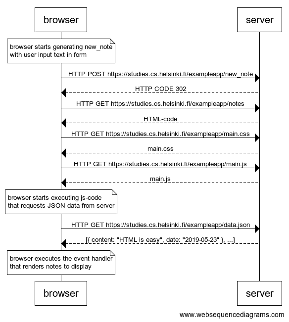

# Question

创建一个类似的图，描述当用户把东西写进文本字段并点击submit按钮，在https://studies.cs.helsinki.fi/exampleapp/notes页上创建一个新笔记的情况。

如果有必要，将浏览器或服务器上的操作显示为图中的注释。

该图不一定是一个序列图。任何合理的渲染事件方式都是可以的。

所有做这个的必要信息，以及接下来的两个练习，都可以从[本章](https://fullstackopen.com/en/part0/fundamentals_of_web_apps#forms-and-http-post)的正文中找到。

这些练习的目的是再一次通读文本，并思考其中的内容。阅读应用的[代码](https://github.com/mluukkai/example_app)不是必须的，但当然也可以。


# Answer

[websequencediagrams](https://www.websequencediagrams.com/) code:

```
note over browser:
browser starts generating new_note 
with user input text in form
end note

browser->server: HTTP POST https://studies.cs.helsinki.fi/exampleapp/new_note
server-->browser: HTTP CODE 302
browser->server: HTTP GET https://studies.cs.helsinki.fi/exampleapp/notes
server-->browser: HTML-code
browser->server: HTTP GET https://studies.cs.helsinki.fi/exampleapp/main.css
server-->browser: main.css
browser->server: HTTP GET https://studies.cs.helsinki.fi/exampleapp/main.js
server-->browser: main.js

note over browser:
browser starts executing js-code
that requests JSON data from server
end note

browser->server: HTTP GET https://studies.cs.helsinki.fi/exampleapp/data.json
server-->browser: [{ content: "HTML is easy", date: "2019-05-23" }, ...]

note over browser:
browser executes the event handler
that renders notes to display
end note
```




