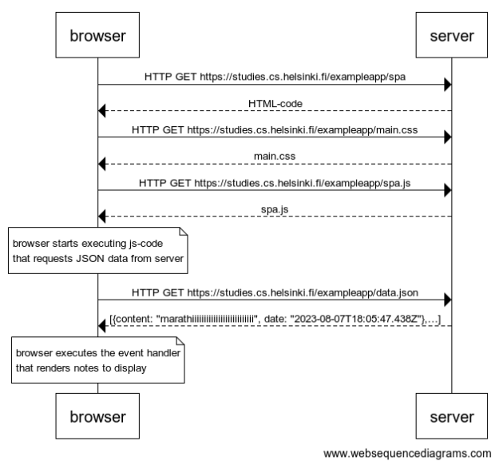

# QUESTION


创建一个图表，描述用户进入单页应用版本的笔记应用的情况，网址为https://studies.cs.helsinki.fi/exampleapp/spa。


# ANSWER


[websequencediagrams](https://www.websequencediagrams.com/) code:

```
browser->server: HTTP GET https://studies.cs.helsinki.fi/exampleapp/spa
server-->browser: HTML-code
browser->server: HTTP GET https://studies.cs.helsinki.fi/exampleapp/main.css
server-->browser: main.css
browser->server: HTTP GET https://studies.cs.helsinki.fi/exampleapp/spa.js
server-->browser: spa.js

note over browser:
browser starts executing js-code
that requests JSON data from server
end note

browser->server: HTTP GET https://studies.cs.helsinki.fi/exampleapp/data.json
server-->browser: [{content: "marathiiiiiiiiiiiiiiiiiiiiiiiiii", date: "2023-08-07T18:05:47.438Z"},…]

note over browser:
browser executes the event handler
that renders notes to display
end note
```



