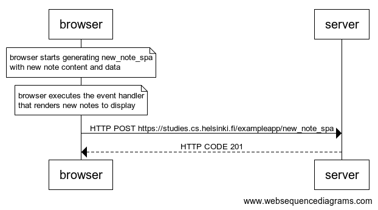

# QUESTION


创建一个图表，描述用户使用单页版应用创建新笔记的情况。


# ANSWER


[websequencediagrams](https://www.websequencediagrams.com/) code:

```
note over browser:
browser starts generating new_note_spa
with new note content and data
end note

note over browser:
browser executes the event handler
that renders new notes to display
end note

browser->server: HTTP POST https://studies.cs.helsinki.fi/exampleapp/new_note_spa
server-->browser: HTTP CODE 201
```



